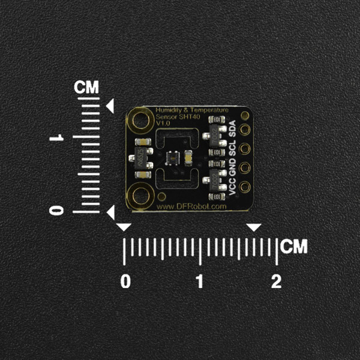

# DFRobot_SHT
* [中文版](./README_CN.md)
## DFRobot_SHTC3

The SHTC3 is a digital humidity and temperature sensor designed especially for high-volume consumer electronics applications.

The sensor covers a humidity measurement range of 0 to 100 %RH and a temperature measurement range of - 40 °C to 125 °C with a typical accuracy of ±2 %RH and ±0.2°C.


## DFRobot_SHT40

The SHT40 sensor covers a humidity measurement range of 0 to 100%RH and a temperature detection range of -40°C to 125°C with a typical accuracy of ±1.8％RH and ±0.2℃. The board supply voltage of 3.3V to 5V and a current consumption below 0.15mA in low power mode make the SHTC3 perfectly suitable for mobile or wireless battery-driven applications.



## Product Wiki（https://www.dfrobot.com/）
[SEN0414](https://www.dfrobot.com.cn/goods-3364.html)
[SEN0428](https://www.dfrobot.com.cn/goods-3364.html)

## Table of Contents

* [Summary](#summary)
* [Installation](#installation)
* [Methods](#methods)
* [Compatibility](#compatibility)
* [History](#history)
* [Credits](#credits)

## Summary
Measurement of temperature and humidity

## Installation

To use this library, download the library file first, paste it into the \Arduino\libraries directory, then open the examples folder and run the demo in the folder.

## Methods—DFRobot_SHT

```C++
  /**
   * @brief  Init board I2C
   */
  void begin();

  /**
   * @brief  Get temperature data 
   * @param  mode  Sensor working mode 
   * @n            SHTC3：
   * @n                    PRECISION_HIGH_CLKSTRETCH_ON                              Clock Stretching Enabled 
   * @n                    PRECISION_HIGH_CLKSTRETCH_OFF                             Clock Stretching Disabled 
   * @n                    PRECISION_LOW_CLKSTRETCH_ON                               Clock Stretching Enabled & Low Power
   * @n                    PRECISION_LOW_CLKSTRETCH_OFF                              Clock Stretching Disabled & Low Power
   * @n            SHT40:
   * @n                    PRECISION_HIGH                                 measure T & RH with high precision (high repeatability) 
   * @n                    PRECISION_MID                                  measure T & RH with medium precision (medium repeatability)
   * @n                    PRECISION_LOW                                  measure T & RH with lowest precision (low repeatability) 
   * @return Return  Temperature value, unit: ℃   Return MODE_ERR: invalid mode 
   */
  float getTemperature(uint16_t mode);

  /**
   * @brief  Get himidity data 
   * @param  mode  Sensor working mode
   * @n            SHTC3：
   * @n                    PRECISION_HIGH_CLKSTRETCH_ON                              Clock Stretching Enabled 
   * @n                    PRECISION_HIGH_CLKSTRETCH_OFF                             Clock Stretching Disabled 
   * @n                    PRECISION_LOW_CLKSTRETCH_ON                               Clock Stretching Enabled & Low Power
   * @n                    PRECISION_LOW_CLKSTRETCH_OFF                              Clock Stretching Disabled & Low Power
   * @n            SHT40:
   * @n                    PRECISION_HIGH                                 measure T & RH with high precision (high repeatability) 
   * @n                    PRECISION_MID                                  measure T & RH with medium precision (medium repeatability)
   * @n                    PRECISION_LOW                                  measure T & RH with lowest precision (low repeatability) 
   * @return Return, humidity value, unit: %RH   Return MODE_ERR: invalid mode
   */
  float getHumidity(uint16_t mode);

  /**
   * @brief  Get temperature and humidity data
   * @param   tem  Reference for storing temperature data 
   * @param   hum  Reference for storing humidity data 
   * @param  mode  Sensor working mode 
   * @n            SHTC3：
   * @n                    PRECISION_HIGH_CLKSTRETCH_ON                              Clock Stretching Enabled 
   * @n                    PRECISION_HIGH_CLKSTRETCH_OFF                             Clock Stretching Disabled 
   * @n                    PRECISION_LOW_CLKSTRETCH_ON                               Clock Stretching Enabled & Low Power
   * @n                    PRECISION_LOW_CLKSTRETCH_OFF                              Clock Stretching Disabled & Low Power
   * @n            SHT40:
   * @n                    PRECISION_HIGH                                 measure T & RH with high precision (high repeatability) 
   * @n                    PRECISION_MID                                  measure T & RH with medium precision (medium repeatability)
   * @n                    PRECISION_LOW                                  measure T & RH with lowest precision (low repeatability) 
   * @return  Return true, mode setting succeed; Return false, mode setting fails 
   */
  bool  getTemHum(float &tem, float &hum,uint16_t mode);

  /**
   * @brief  Get sensor unique identifier 
   * @return Return sensor unique identifier for success, return 0 for failure
   */
   uint32_t getDeviceID();

  /**
   * @brief  software reset
   */
   void softwareReset() ;

  /**
   * @brief  Obtain raw data of temperature and humidity
   * @param  temp Pointer to the address of the original value of the temperature
   * @param  hun   Pointer to the address of the original value of the humidity
   * @return Is the data obtained correct? return true  The data is correct ; return false  The data  is incorrect
   */
   bool getTandRHRawData(uint16_t *temp, uint16_t *hum);

```

## Methods—DFRobot_SHTC3

```C++
  /**
   * @brief  Init Wire, and perform software reset of the sensor, let the sensor enter sleep mode, and wake it up when necessary 
   */
  void begin();

  /**
   * @brief  When in sleep mode, the sensor needs to be awakened before communicating   
   */
  void wakeup();
  
  /**
   * @brief  Set sensor to sleep mode. When done, the sensor cannot obtain data before waking up 
   */
  void sleep();
```

## Methods—DFRobot_SHT40

```C++
  /**
   * @brief  Init Wire, and perform software reset of the sensor 
   */
  void begin();

  /**
   * @brief  Enable heater 
   * @param  mode  heating mode 
   * @n                    POWER_CONSUMPTION_H_HEATER_1S                                  activate highest heater power & high precis. meas. for 1s 
   * @n                    POWER_CONSUMPTION_H_HEATER_100MS                               activate highest heater power & high precis. meas. for 0.1s
   * @n                    POWER_CONSUMPTION_M_HEATER_1S                                   activate medium heater power  & high precis. meas. for 1s 
   * @n                    POWER_CONSUMPTION_M_HEATER_100MS                                activate medium heater power  & high precis. meas. for 0.1s 
   * @n                    POWER_CONSUMPTION_L_HEATER_1S                                   activate lowest heater power  & high precis. meas. for 1s 
   * @n                    POWER_CONSUMPTION_L_HEATER_100MS                                activate lowest heater power  & high precis. meas. for 0.1s 
   */
  void enHeater(uint8_t mode);
```


## Compatibility

### DFRobot_SHTC3

| MCU                | Work Well | Work Wrong | Untested | Remarks |
| ------------------ | :-------: | :--------: | :------: | ------- |
| Arduino uno        |     √     |            |          |         |
| FireBeetle esp32   |     √     |            |          |         |
| FireBeetle esp8266 |     √     |            |          |         |
| FireBeetle m0      |     √     |            |          |         |
| Leonardo           |     √     |            |          |         |
| Microbit           |     √     |            |          |         |
| Arduino MEGA2560   |     √     |            |          |         |

### DFRobot_SHT40

| MCU                | Work Well | Work Wrong | Untested | Remarks |
| ------------------ | :-------: | :--------: | :------: | ------- |
| Arduino uno        |     √     |            |          |         |
| FireBeetle esp32   |     √     |            |          |         |
| FireBeetle esp8266 |     √     |            |          |         |
| FireBeetle m0      |     √     |            |          |         |
| Leonardo           |     √     |            |          |         |
| Microbit           |     √     |            |          |         |
| Arduino MEGA2560   |     √     |            |          |         |

## History

- Date 2021-03-19
- Version V1.0


## Credits

Written by [yangfeng]<feng.yang@dfrobot.com>,2021,(Welcome to our [website](https://www.dfrobot.com/))
