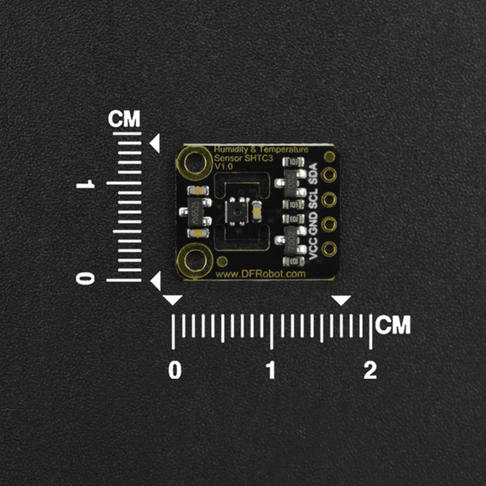
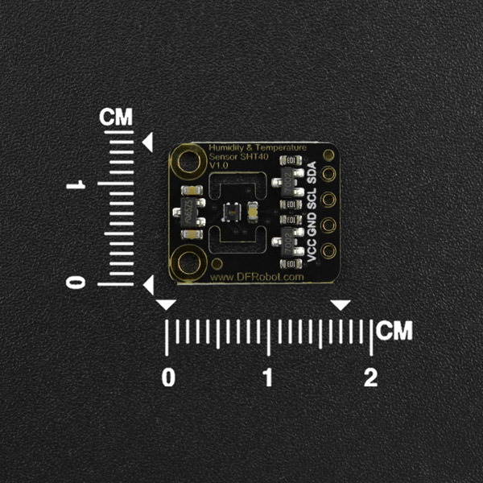

# DFRobot_SHT

* [English Version](./README.md)

## DFRobot_SHTC3

SHTC3是一种数字湿度和温度传感器，专为大容量消费电子应用而设计。
湿度测量范围为0 ~ 100%RH，温度测量范围为- 40°C ~ 125°C，典型精度为±2% RH和±0.2°C。



## DFRobot_SHT40

SHT40传感器湿度测量范围为0 ~ 100%RH，温度检测范围为-40°C ~ 125°C，典型精度为±1.8%RH和±0.2℃。在低功耗模式下，SHTC3的板供电电压为3.3V至5V，电流消耗低于0.15mA，这使得SHTC3非常适合移动或无线电池驱动应用。



## 产品链接(https://www.dfrobot.com/)

[SEN0414](https://www.dfrobot.com.cn/goods-3364.html)
[SEN0428](https://www.dfrobot.com.cn/goods-3364.html)

## Table of Contents

* [概述](#概述)
* [库安装](#库安装)
* [方法](#方法)
* [兼容性](#兼容性)
* [历史](#历史)
* [创作者](#创作者)

## 概述
测量温度和湿度

## 库安装

这里提供两种使用本库的方法：
1. 打开Arduino IDE,在状态栏中的Tools--->Manager Libraries 搜索"DFRobot_SHT"并安装本库.
2. 首先下载库文件,将其粘贴到\Arduino\libraries目录中,然后打开examples文件夹并在该文件夹中运行演示.

## DFRobot_SHT类方法

```C++
  /**
   * @brief  初始化IIC
   */
  void begin();

  /**
   * @brief  获取温度数据
   * @param  mode  传感器工作模式
   * @n            SHTC3：
   * @n                    PRECISION_HIGH_CLKSTRETCH_ON                              启用时钟延展
   * @n                    PRECISION_HIGH_CLKSTRETCH_OFF                             禁用时钟延展
   * @n                    PRECISION_LOW_CLKSTRETCH_ON                               低功耗模式并启用时钟延展
   * @n                    PRECISION_LOW_CLKSTRETCH_OFF                              低功耗模式并禁用时钟延展
   * @n            SHT40:
   * @n                    PRECISION_HIGH                                 高精度模式
   * @n                    PRECISION_MID                                  中等精度模式
   * @n                    PRECISION_LOW                                  低精度模式
   * @return 成功返回温度值   失败返回MODE_ERR，代表无效的模式
   */
  float getTemperature(uint16_t mode);

  /**
   * @brief  获取湿度数据
   * @param  mode  传感器工作模式
   * @n            SHTC3：
   * @n                    PRECISION_HIGH_CLKSTRETCH_ON                              启用时钟延展
   * @n                    PRECISION_HIGH_CLKSTRETCH_OFF                             禁用时钟延展
   * @n                    PRECISION_LOW_CLKSTRETCH_ON                               低功耗模式并启用时钟延展
   * @n                    PRECISION_LOW_CLKSTRETCH_OFF                              低功耗模式并禁用时钟延展
   * @n            SHT40:
   * @n                    PRECISION_HIGH                                 高精度模式
   * @n                    PRECISION_MID                                  中等精度模式
   * @n                    PRECISION_LOW                                  低精度模式
   * @return 成功返回湿度值   失败返回MODE_ERR，代表无效的模式
   */
  float getHumidity(uint16_t mode);

  /**
   * @brief  获取温湿度数据
   * @param   tem  温度数据的引用
   * @param   hum  湿度数据的引用
   * @param  mode  传感器工作模式
   * @n            SHTC3：
   * @n                    PRECISION_HIGH_CLKSTRETCH_ON                             启用时钟延展 
   * @n                    PRECISION_HIGH_CLKSTRETCH_OFF                            禁用时钟延展
   * @n                    PRECISION_LOW_CLKSTRETCH_ON                              低功耗模式并启用时钟延展
   * @n                    PRECISION_LOW_CLKSTRETCH_OFF                             低功耗模式并禁用时钟延展
   * @n            SHT40:
   * @n                    PRECISION_HIGH                                高精度模式 
   * @n                    PRECISION_MID                                 中等精度模式
   * @n                    PRECISION_LOW                                 低精度模式
   * @return  返回true，代表模式设置成功，返回false，代表模式设置失败
   */
  bool  getTemHum(float &tem, float &hum,uint16_t mode);

  /**
   * @brief  获取传感器唯一标识符
   * @return 返回传感器唯一标识符为成功，返回0为失败
   */
   uint32_t getDeviceID();

  /**
   * @brief  软复位
   */
   void softwareReset() ;

  /**
   * @brief  获取温湿度的原始数据
   * @param  temp 指向温度原始值的地址指针
   * @param  hun  指向湿度原始值的地址指针
   * @return 获得的数据是否正确?返回true,数据是正确的;返回false,数据不正确
   */
   bool getTandRHRawData(uint16_t *temp, uint16_t *hum);

```

## DFRobot_SHTC3类方法

```C++
  /**
   * @brief  初始化Wire，对传感器进行软件复位，让传感器进入睡眠模式，必要时唤醒传感器
   */
  void begin();

  /**
   * @brief  当处于睡眠模式时，传感器需要在通信之前被唤醒
   */
  void wakeup();
  
  /**
   * @brief  设置传感器为睡眠模式。当这样做时，传感器在唤醒之前无法获取数据
   */
  void sleep();
```

## DFRobot_SHT40类方法

```C++
  /**
   * @brief  初始化Wire，软件复位传感器
   */
  void begin();

  /**
   * @brief  使能加热器
   * @param  mode  加热器模式
   * @n                    POWER_CONSUMPTION_H_HEATER_1S                                  激活最高级别的加热器1秒
   * @n                    POWER_CONSUMPTION_H_HEATER_100MS                               激活最高级别的加热器0.1秒
   * @n                    POWER_CONSUMPTION_M_HEATER_1S                                  激活中等级别的加热器1秒
   * @n                    POWER_CONSUMPTION_M_HEATER_100MS                               激活中等级别的加热器0.1秒
   * @n                    POWER_CONSUMPTION_L_HEATER_1S                                  激活低级别的加热器1秒
   * @n                    POWER_CONSUMPTION_L_HEATER_100MS                               激活低等级别的加热器0.1秒
   */
  void enHeater(uint8_t mode);
```


## 兼容性

### DFRobot_SHTC3

| 主控               |  正常运行 |  运行失败   |  未测试  |   备注   |
| ------------------ | :-------: | :--------: | :------: | ------- |
| Arduino uno        |     √     |            |          |         |
| FireBeetle esp32   |     √     |            |          |         |
| FireBeetle esp8266 |     √     |            |          |         |
| FireBeetle m0      |     √     |            |          |         |
| Leonardo           |     √     |            |          |         |
| Microbit           |     √     |            |          |         |
| Arduino MEGA2560   |     √     |            |          |         |

### DFRobot_SHT40

| 主控                |  正常运行 |  运行失败   |  未测试  |   备注   |
| ------------------ | :-------: | :--------: | :------: | ------- |
| Arduino uno        |     √     |            |          |         |
| FireBeetle esp32   |     √     |            |          |         |
| FireBeetle esp8266 |     √     |            |          |         |
| FireBeetle m0      |     √     |            |          |         |
| Leonardo           |     √     |            |          |         |
| Microbit           |     √     |            |          |         |
| Arduino MEGA2560   |     √     |            |          |         |

## 历史

- 2022/03/21 - 1.0.0 版本


## 创作者

Written by [yangfeng]<feng.yang@dfrobot.com>,2021,(Welcome to our [website](https://www.dfrobot.com/))
